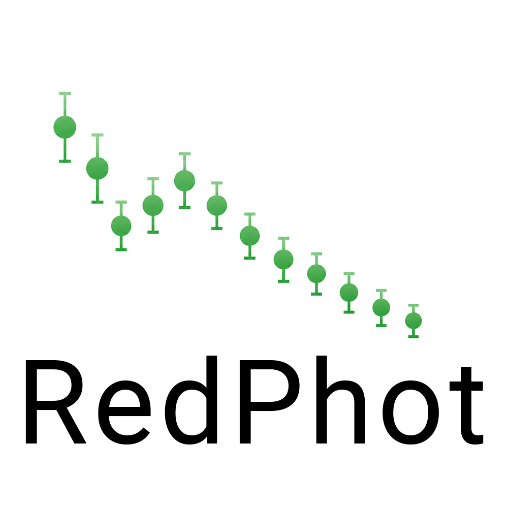

RedPhot
========

RedPhot is a function-based Python package for robust time-domain optical
photometry of supernovae. It reads already reduced FITS images, preserves the
original pixels, performs forced aperture and PSF measurements, optionally
subtracts templates, and produces traceable light curves and diagnostics.

The package is designed around LCO and KeplerCam data but keeps instrument
metadata and processing choices configurable. IRAF and PyRAF are not required.

.. warning::

   Version 0.1 is a development release. The stable-release requirements in
   :doc:`validation` have not yet been completed on a full real multi-filter
   supernova batch.

.. toctree::
   :maxdepth: 2
   :caption: User Guide

   installation
   algorithms
   tutorials/running_pipeline
   reference
   configuration
   api
   outputs
   instruments
   troubleshooting
   validation

License
-------

Copyright Sebastian Gomez and contributors. RedPhot is distributed under the
MIT License.
